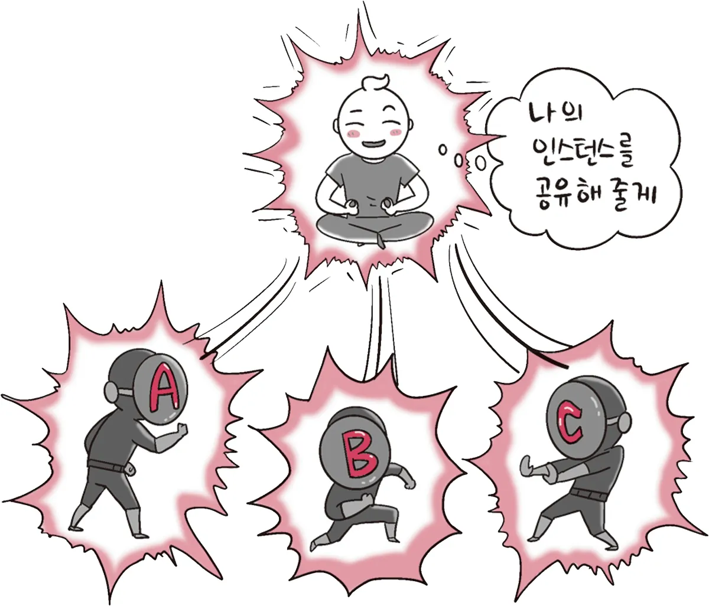

# 1주차 학습 정리: 디자인 패턴과 프로그래밍 패러다임

> **학습 기간**: 2025.09.01 ~ 2025.09.08
> **발표 일정**: 2025.09.09 (화) 18:30-19:30

## 📚 학습 내용 정리

### 1.1 디자인 패턴

#### 1.1.1 싱글톤 패턴 (Singleton Pattern)

**개념**
- 

싱글톤 패턴(singleton pattern)은 하나의 클래스에 오직 하나의 인스턴스만 가지는 패턴입니다. 

하나의 클래스를 기반으로 여러 개의 개별적인 인스턴스를 만들 수 있지만, 그렇게 하지 않고 하나의 클래스를 기반으로 단 하나의 인스턴스를 만들어 이를 기반으로 로직을 만드는 데 쓰이며,보통 데이터베이스 연결 모듈에 많이 사용합니다.

**구현 방법**
-
Eager Init과 Lazy Init으로 크게 두 가지 방법이 존재합니다.
Lazy Init 시에 MultiThread 환경에서 Thread-safe 하지 않기 때문에, 이를 극복하기 위해서 여러 해결방법이 존재합니다.

- Eager Initialization
- Lazy initialization
1. Thread safe Lazy initialization
2. Thread safe Lazy initialization + Double-checked locking
3. Bill Pugh Solution(Initialization on demand holder idiom)
4. Enum initialization

**장점**
- 
하나의 인스턴스를 만들어 놓고 해당 인스턴스를 다른 모듈들이 공유하며 사용하기 때문에 인스턴스를 생성할 때 드는 비용이 줄어드는 장점이 있습니다.

**단점**
- 
1. 싱글톤 패턴은 미리 생성된 하나의 인스턴스를 기반으로 구현하는 패턴이므로 각 테스트 마다 '독립적인' 인스턴스를 만들기가 힘들어서, TDD 할 때 어려움을 겪을 수 있습니다. <br/>
=> 이를 어느정도 해결하기 위해 DI(Dependency Injection)을 이용하는 방안이 있습니다.

2. SOLID 원칙의 단일 책임 원칙(SRP)와 개방-폐쇄 원칙(OCP)에도 위배되고, 마지막으로 구체 클래스에 의존하게 되어서 의존 역전 원칙(DIP)에도 위배됩니다.

3. 모듈간 의존성이 높아집니다.

**사용 사례**
- 
1. 데이터 베이스 연결 모듈
2. 게임 개발 시 게임의 메인 흐름을 관리 및 제어하는 GameManager 클래스

**코드 예제**
```java
class Singleton {
    private static class singleInstanceHolder {
        private static final Singleton INSTANCE = new Singleton();
    }
    public static Singleton getInstance() {
        return singleInstanceHolder.INSTANCE;
    }
}

public class HelloWorld{ 
     public static void main(String []args){ 
        Singleton a = Singleton.getInstance(); 
        Singleton b = Singleton.getInstance(); 
        System.out.println(a.hashCode());
        System.out.println(b.hashCode());  
        if (a == b){
         System.out.println(true); 
        } 
     }
}
/*
705927765
705927765
true
```
```javascript
class Singleton {
    constructor() {
        if (!Singleton.instance) {
            Singleton.instance = this
        }
        return Singleton.instance
    }
    getInstance() {
        return this 
    }
}
const a = new Singleton()
const b = new Singleton() 
console.log(a === b) // true 
```

---

#### 1.1.2 팩토리 패턴 (Factory Pattern)

**개념**
- 

**구현 방법**
- 

**장점**
- 

**단점**
- 

**사용 사례**
- 

**코드 예제**
```java
// 팩토리 패턴 구현 예제
```

---

#### 1.1.3 전략 패턴 (Strategy Pattern)

**개념**
- 

**구현 방법**
- 

**장점**
- 

**단점**
- 

**사용 사례**
- 

**코드 예제**
```java
// 전략 패턴 구현 예제
```

---

#### 1.1.4 옵저버 패턴 (Observer Pattern)

**개념**
- 

**구현 방법**
- 

**장점**
- 

**단점**
- 

**사용 사례**
- 

**코드 예제**
```java
// 옵저버 패턴 구현 예제
```

---

#### 1.1.5 프록시 패턴과 프록시 서버 (Proxy Pattern)

**개념**
- 

**구현 방법**
- 

**장점**
- 

**단점**
- 

**사용 사례**
- 

**코드 예제**
```java
// 프록시 패턴 구현 예제
```

---

#### 1.1.6 이터레이터 패턴 (Iterator Pattern)

**개념**
- 

**구현 방법**
- 

**장점**
- 

**단점**
- 

**사용 사례**
- 

**코드 예제**
```java
// 이터레이터 패턴 구현 예제
```

---

#### 1.1.7 노출모듈 패턴 (Revealing Module Pattern)

**개념**
- 

**구현 방법**
- 

**장점**
- 

**단점**
- 

**사용 사례**
- 

**코드 예제**
```javascript
// 노출모듈 패턴 구현 예제 (JavaScript)
```

---

#### 1.1.8 MVC 패턴 (Model-View-Controller)

**개념**
- 

**구조**
- Model: 
- View: 
- Controller: 

**장점**
- 

**단점**
- 

**사용 사례**
- 

---

#### 1.1.9 MVP 패턴 (Model-View-Presenter)

**개념**
- 

**구조**
- Model: 
- View: 
- Presenter: 

**MVC와의 차이점**
- 

**장점**
- 

**단점**
- 

---

#### 1.1.10 MVVM 패턴 (Model-View-ViewModel)

**개념**
- 

**구조**
- Model: 
- View: 
- ViewModel: 

**특징**
- 

**장점**
- 

**단점**
- 

---

### 1.2 프로그래밍 패러다임

#### 1.2.1 선언형과 함수형 프로그래밍

**선언형 프로그래밍**
- **개념**: 
- **특징**: 
- **장점**: 
- **단점**: 

**함수형 프로그래밍**
- **개념**: 
- **핵심 원칙**: 
  - 순수 함수 (Pure Function): 
  - 불변성 (Immutability): 
  - 고차 함수 (Higher-order Function): 
- **장점**: 
- **단점**: 

**코드 예제**
```javascript
// 선언형 프로그래밍 예제

// 함수형 프로그래밍 예제
```

---

#### 1.2.2 객체지향 프로그래밍

**개념**
- 

**4가지 특징**
1. **추상화 (Abstraction)**
   - 

2. **캡슐화 (Encapsulation)**
   - 

3. **상속 (Inheritance)**
   - 

4. **다형성 (Polymorphism)**
   - 

**설계 원칙 (SOLID)**
- **S**: Single Responsibility Principle
  - 

- **O**: Open/Closed Principle
  - 

- **L**: Liskov Substitution Principle
  - 

- **I**: Interface Segregation Principle
  - 

- **D**: Dependency Inversion Principle
  - 

**장점**
- 

**단점**
- 

**코드 예제**
```java
// 객체지향 프로그래밍 예제
```

---

#### 1.2.3 절차형 프로그래밍

**개념**
- 

**특징**
- 

**장점**
- 

**단점**
- 

**객체지향과의 차이점**
- 

**코드 예제**
```c
// 절차형 프로그래밍 예제 (C언어)
```

---

#### 1.2.4 패러다임의 혼합

**혼합 사용의 이유**
- 

**혼합 사용 예시**
- 

**현대 언어의 멀티 패러다임**
- Java: 
- Python: 
- JavaScript: 
- Scala: 

---

## ❓ 학습한 질문과 답변

### Q1. 
**A**: 

### Q2. 
**A**: 

### Q3. 
**A**: 

---

## 🔗 참고 자료

### 도서
- 면접을 위한 CS 전공지식 노트 (1장)
- 

### 온라인 자료
- 
- 

### 추가 학습
- 
- 

---

## 📝 학습 후기

### 어려웠던 점
- 

### 새롭게 알게 된 점
- 

### 실무 적용 방안
- 

### 추가 학습 계획
- 

---

**작성일**: 2025.09.XX  
**최종 수정**: 2025.09.XX
