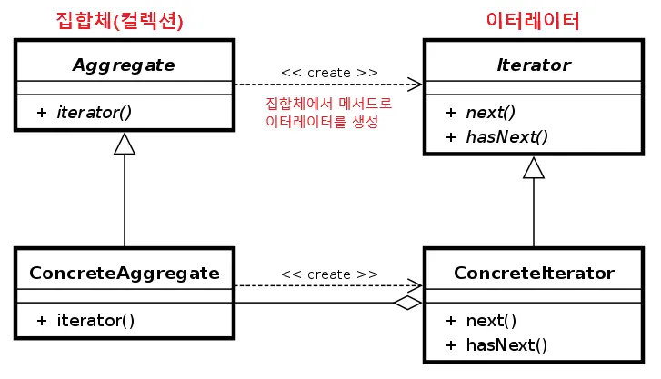

# 1주차 학습 정리: 디자인 패턴과 프로그래밍 패러다임

> **학습 기간**: 2025.09.01 ~ 2025.09.08
> **발표 일정**: 2025.09.09 (화) 18:30-19:30

## 📚 학습 내용 정리

### 1.1 디자인 패턴

#### 1.1.1 싱글톤 패턴 (Singleton Pattern)

**개념**
- 

싱글톤 패턴(singleton pattern)은 하나의 클래스에 오직 하나의 인스턴스만 가지는 패턴입니다. 

하나의 클래스를 기반으로 여러 개의 개별적인 인스턴스를 만들 수 있지만, 그렇게 하지 않고 하나의 클래스를 기반으로 단 하나의 인스턴스를 만들어 이를 기반으로 로직을 만드는 데 쓰이며,보통 데이터베이스 연결 모듈에 많이 사용합니다.

**구현 방법**
-
Eager Init과 Lazy Init으로 크게 두 가지 방법이 존재합니다.
Lazy Init 시에 MultiThread 환경에서 Thread-safe 하지 않기 때문에, 이를 극복하기 위해서 여러 해결방법이 존재합니다.

<b>Eager Initialization</b>

``` java
public class Singleton {
    // Eager Initialization
    private static Singleton uniqueInstance = new Singleton();

    private Singleton() {}

    public static Singleton getInstance() {
      return uniqueInstance; 
    } 
}
```
- 장점
    - 클래스 로더에 의해 클래스가 최초 로딩 될 때 객체가 생성됨으로 Thread-safe합니다.
- 단점
    - 싱글톤객체 사용유무와 관계없이 클래스가 로딩되는 시점에 항상 싱글톤 객체가 생성되고, 메모리를 잡고있기 때문에 비효율적일 수 있습니다.

<b>Lazy initialization</b>

``` java
public class LazyInitialization {

	private static LazyInitialization instance;

	private LazyInitialization(){}

	public static LazyInitialization getInstance(){
		if(instance == null){
			instance = new LazyInitialization();
		}
		return instance;
	}

}
```

- 장점
    - 싱글톤 객체가 필요할 때 인스턴스를 얻을 수 있습니다.
    - Eager initialization 방식에 단점을 보완할 수 있습니다.(메모리 누수 방지)
- 단점
    - 만약 multi-thread 환경에서 여러 곳에서 동시에 getInstance()를 호출할 경우 인스턴스가 두번 생성될 여지가 있습니다.
    - 즉 multi-thread 환경에서는 싱글톤 철학이 깨질 수 있는 위험이 있습니다.

1. Thread safe Lazy initialization
```java
class Singleton {
    private static Singleton instance;

    private Singleton() {}

    // synchronized 메서드
    public static synchronized Singleton getInstance() {
        if (instance == null) {
            instance = new Singleton();
        }
        return instance;
    }
}
```

- 장점
    - Lazy initialization 방식에서 thread-safe하지 않은 점을 보완합니다.
- 단점
    - synchronized 키워드를 사용할 경우 자바 내부적으로 해당 영역이나 메서드를 lock, unlock 처리하기 때문에 내부적으로 많은 cost가 발생합니다. 
    따라서 많은 thread 들이 getInstance()를 호출하게 되면 프로그램 전반적인 성능저하가 발생합니다.

2. Thread safe Lazy initialization+ Double-checked locking
``` java
class Singleton {
    private static Singleton instance;

    private Singleton() {}

    // synchronized 메서드
    public static synchronized Singleton getInstance() {
        if (instance == null) {
            instance = new Singleton();
        }
        return instance;
    }
}
```

- 장점
    - synchronized 호출을 줄여서 성능저하를 조금 더 완화시킬 수 있습니다.
- 단점
    - 하지만 여전히 성능 저하를 회피할 수 없습니다.

3. Bill Pugh Solution(Initialization on demand holder idiom)
``` java
class Singleton {

    private Singleton() {}

    // static 내부 클래스를 이용
    // Holder로 만들어, 클래스가 메모리에 로드되지 않고 getInstance 메서드가 호출되어야 로드됨
    private static class SingleInstanceHolder {
        private static final Singleton INSTANCE = new Singleton();
    }

    public static Singleton getInstance() {
        return SingleInstanceHolder.INSTANCE;
    }
}
```

- 장점
    - 내부클래스를 static으로 선언하였기 때문에, 싱글톤 클래스가 초기화되어도 SingleInstanceHolder 내부 클래스는 메모리에 로드되지 않습니다.
    - 어떠한 모듈에서 `getInstance()` 메서드를 호출할 때, SingleInstanceHolder 내부 클래스의 static 멤버를 가져와 리턴하게 되는데, 이때 내부 클래스가 한번만 초기화되면서 싱글톤 객체를 최초로 생성 및 리턴하게 됩니다.
   - 마지막으로 final 로 지정함으로서 다시 값이 할당되지 않도록 방지합니다.
- 단점
    - 클라이언트 사이드에서 파괴하는 방법을 막을 수 없습니다.
    - Reflection API (생성자에서 이미 인스턴스가 존재하는지 확인로 방어 가능)
    - 직렬화/역직렬화 (readResolve() 메서드로 기존 인스턴스 반환)


4. Enum initialization
``` java
public enum EnumSingleTon {

		INSTANCE;
		public void excute(String arg){
			//...code
		}
}
```
- 장점
    - enum은 애초에 멤버를 만들때 private로 만들고 한번만 초기화 하기 때문에 thread safe합니다.
    - enum 내에서 상수 뿐만 아니라, 변수나 메서드를 선언해 사용이 가능하기 때문에, 이를 이용해 싱글톤 클래스 처럼 응용이 가능합니다.
- 단점
    - 싱글톤 클래스를 멀티톤(일반적인 클래스)으로 마이그레이션 해야할때 처음부터 코드를 다시 짜야 되는 단점이 존재합니다.
    - 클래스 상속이 필요할때, enum 외의 클래스 상속은 불가능합니다.


**장점**
- 
하나의 인스턴스를 만들어 놓고 해당 인스턴스를 다른 모듈들이 공유하며 사용하기 때문에 인스턴스를 생성할 때 드는 비용이 줄어드는 장점이 있습니다.

**단점**
- 
1. 싱글톤 패턴은 미리 생성된 하나의 인스턴스를 기반으로 구현하는 패턴이므로 각 테스트 마다 '독립적인' 인스턴스를 만들기가 힘들어서, TDD 할 때 어려움을 겪을 수 있습니다. <br/>
=> 이를 어느정도 해결하기 위해 DI(Dependency Injection)을 이용하는 방안이 있습니다.

2. SOLID 원칙의 단일 책임 원칙(SRP)와 개방-폐쇄 원칙(OCP)에도 위배되고, 마지막으로 구체 클래스에 의존하게 되어서 의존 역전 원칙(DIP)에도 위배됩니다.

3. 모듈간 의존성이 높아집니다.

**사용 사례**
- 
1. 데이터 베이스 연결 모듈
2. 게임 개발 시 게임의 메인 흐름을 관리 및 제어하는 GameManager 클래스

**코드 예제**
```java
class Singleton {
    private static class singleInstanceHolder {
        private static final Singleton INSTANCE = new Singleton();
    }
    public static Singleton getInstance() {
        return singleInstanceHolder.INSTANCE;
    }
}

public class HelloWorld{ 
     public static void main(String []args){ 
        Singleton a = Singleton.getInstance(); 
        Singleton b = Singleton.getInstance(); 
        System.out.println(a.hashCode());
        System.out.println(b.hashCode());  
        if (a == b){
         System.out.println(true); 
        } 
     }
}
/*
705927765
705927765
true
```
```javascript
class Singleton {
    constructor() {
        if (!Singleton.instance) {
            Singleton.instance = this
        }
        return Singleton.instance
    }
    getInstance() {
        return this 
    }
}
const a = new Singleton()
const b = new Singleton() 
console.log(a === b) // true 
```

---

#### 1.1.2 팩토리 패턴 (Factory Pattern)

**개념**
- 

팩토리 패턴(factory pattern)은 객체를 사용하는 코드에서 객체 생성 부분을 떼어내 추상화한 패턴이자 상속 관계에 있는 두 클래스에서 상위 클래스가 중요한 뼈대를 결정하고, 하위 클래스에서 객체 생성에 관한 구체적인 내용을 결정하는 패턴입니다.


**구현 방법**

- Creator : Factory의 기본 역할을 정의하는 객체
    - 객체 생성 처리 메서드(someOperartion) : 객체 생성에 관한 전처리, 후처리를 템플릿화한 메소드
    - 팩토리 메서드(createProduct) : 서브 공장 클래스에서 재정의할 객체 생성 추상 메서드
- ConcreteCreator
    - Creator를 채택하고 있으며 Product에 맞는 구체적 기능을 구현
- Product
    - Concrete Product가 해야 할 동작들을 선언하는 객체
- ConcreteProduct
    - Product를 채택하며 그에 맞게 만든 실제 객체

**장점**
- 
- 상위 클래스와 하위 클래스가 분리되기 때문에 느슨한 결합을 가지며 상위 클래스에서는 인스턴스 생성 방식에 대해 전혀 알 필요가 없기 때문에 더 많은 유연성을 갖게 됩니다.
- 객체 생성 로직이 따로 떼어져 있기 때문에 코드를 리팩터링하더라도 한 곳만 고칠 수 있게 되니 유지 보수성이 증가됩니다.

**단점**
- 각 제품 구현체마다 팩토리 객체들을 모두 구현해주어야 하기 때문에, 구현체가 늘어날때 마다 팩토리 클래스가 증가하여 서브 클래스 수가 급격하게 많아집니다. (이를 해결하기 위해서 Dynamic Factory Pattern을 사용하기도 합니다.)

**사용 사례**
- 
BeanFactory (Spring 컨테이너의 최상위 인터페이스)


**코드 예제**
```java
enum CoffeeType {
    LATTE,
    ESPRESSO
}

abstract class Coffee {
    protected String name;

    public String getName() {
        return name;
    }
}

class Latte extends Coffee {
    public Latte() {
        name = "latte";
    }
}

class Espresso extends Coffee {
    public Espresso() {
        name = "Espresso";
    }
}

class CoffeeFactory {
    public static Coffee createCoffee(CoffeeType type) {
        switch (type) {
            case LATTE:
                return new Latte();
            case ESPRESSO:
                return new Espresso();
            default:
                throw new IllegalArgumentException("Invalid coffee type: " + type);
        }
    }
}

public class Main {
    public static void main(String[] args) { 
        Coffee coffee = CoffeeFactory.createCoffee(CoffeeType.LATTE); 
        System.out.println(coffee.getName()); // latte
    }
}
```
```javascript
num = new Object(42)
const str = new Object('abc')
num.constructor.name; // Number
str.constructor.name; // String
```

#### 1.1.3 전략 패턴 (Strategy Pattern)

**개념**
- 

전략 패턴(strategy pattern)은 정책 패턴(policy pattern)이라고도 하며, 객체의 행위를 바꾸고 싶은 경우 ‘직접’ 수정하지 않고 전략이라고 부르는 ‘캡슐화한 알고리즘’을 컨텍스트 안에서 바꿔주면서 상호 교체가 가능하게 만드는 패턴입니다.


**구현 방법**
- 

- **전략 알고리즘 객체들** : 알고리즘, 행위, 동작을 객체로 정의한 구현체
- **전략 인터페이스** : 모든 전략 구현제에 대한 공용 인터페이스
- **컨텍스트(Context)** : 알고리즘을 실행해야 할 때마다 해당 알고리즘과 연결된 전략 객체의 메소드를 호출.
- **클라이언트** : 특정 전략 객체를 컨텍스트에 전달 함으로써 전략을 등록하거나 변경하여 전략 알고리즘을 실행한 결과를 누린다.

**장점**
- 
- 알고리즘을 쉽게 변경 및 대체할 수 있으므로 유연함
- 알고리즘 추가 및 수정을 할 때 코드 수정이 최소화되므로 확장성이 높아짐
- 알고리즘을 캡슐화했기에 코드 재사용성이 좋음
- 각각 알고리즘을 독립적으로 테스트할 수 있으므로 용이함

**단점**
- 
- 추가적인 클래스 및 인터페이스가 필요하기에 코드 복잡성이 증가될 수 있습니다.
- 런타임 시에 알고리즘을 선택하는 데 추가적인 오버헤드 발생 가능합니다.

**사용 사례**
- 
- Node 진영의 passport 전략 패턴 (OAuth)
- Collections의 `sort()` 메서드에 의해 구현되는 `compare()` 메서드에 이용
- javax.servlet.http.HttpServlet에서 service() 메서드와 모든 doXXX() 메서드에 이용
- javax.servlet.Filter의 `doFilter()` 메서드에 이용

**코드 예제**
```java
import java.text.DecimalFormat;
import java.util.ArrayList;
import java.util.List;
interface PaymentStrategy { 
    public void pay(int amount);
} 

class KAKAOCardStrategy implements PaymentStrategy {
    private String name;
    private String cardNumber;
    private String cvv;
    private String dateOfExpiry;
    
    public KAKAOCardStrategy(String nm, String ccNum, String cvv, String expiryDate){
        this.name=nm;
        this.cardNumber=ccNum;
        this.cvv=cvv;
        this.dateOfExpiry=expiryDate;
    }

    @Override
    public void pay(int amount) {
        System.out.println(amount +" paid using KAKAOCard.");
    }
} 

class LUNACardStrategy implements PaymentStrategy {
    private String emailId;
    private String password;
    
    public LUNACardStrategy(String email, String pwd){
        this.emailId=email;
        this.password=pwd;
    }
    
    @Override
    public void pay(int amount) {
        System.out.println(amount + " paid using LUNACard.");
    }
} 

class Item { 
    private String name;
    private int price; 
    public Item(String name, int cost){
        this.name=name;
        this.price=cost;
    }

    public String getName() {
        return name;
    }

    public int getPrice() {
        return price;
    }
} 

class ShoppingCart { 
    List<Item> items;
    
    public ShoppingCart(){
        this.items=new ArrayList<Item>();
    }
    
    public void addItem(Item item){
        this.items.add(item);
    }
    
    public void removeItem(Item item){
        this.items.remove(item);
    }
    
    public int calculateTotal(){
        int sum = 0;
        for(Item item : items){
            sum += item.getPrice();
        }
        return sum;
    }
    
    public void pay(PaymentStrategy paymentMethod){
        int amount = calculateTotal();
        paymentMethod.pay(amount);
    }
}  

public class HelloWorld{
    public static void main(String []args){
        ShoppingCart cart = new ShoppingCart();
        
        Item A = new Item("kundolA",100);
        Item B = new Item("kundolB",300);
        
        cart.addItem(A);
        cart.addItem(B);
        
        // pay by LUNACard
        cart.pay(new LUNACardStrategy("kundol@example.com", "pukubababo"));
        // pay by KAKAOBank
        cart.pay(new KAKAOCardStrategy("Ju hongchul", "123456789", "123", "12/01"));
    }
}
/*
400 paid using LUNACard.
400 paid using KAKAOCard.
*/
```
```javascript
var passport = require('passport')
    , LocalStrategy = require('passport-local').Strategy;

passport.use(new LocalStrategy(
    function(username, password, done) {
        User.findOne({ username: username }, function (err, user) {
          if (err) { return done(err); }
            if (!user) {
                return done(null, false, { message: 'Incorrect username.' });
            }
            if (!user.validPassword(password)) {
                return done(null, false, { message: 'Incorrect password.' });
            }
            return done(null, user);
        });
    }
));
```
---

#### 1.1.4 옵저버 패턴 (Observer Pattern)

**개념**
- 

옵저버 패턴(observer pattern)은 주체가 어떤 객체(subject)의 상태 변화를 관찰하다가 상태 변화가 있을 때마다 메서드 등을 통해 옵저버 목록에 있는 옵저버들에게 변화를 알려주는 디자인 패턴입니다.
옵저버 패턴은 주로 이벤트 기반 시스템에 사용하며 MVC(Model-View-Controller) 패턴에도 사용됩니다.

예를 들어 주체라고 볼 수 있는 모델(model)에서 변경 사항이 생겨 update() 메서드로 옵저버인 뷰에 알려주고 이를 기반으로 컨트롤러(controller) 등이 작동하는 것이죠.

**구현 방법**
- 
- 프록시 객체를 이용한 옵저버 패턴
```java
function createReactiveObject(target, callback) { 
    const proxy = new Proxy(target, {
        set(obj, prop, value){
            if(value !== obj[prop]){
                const prev = obj[prop]
                obj[prop] = value 
                callback(`${prop}가 [${prev}] >> [${value}] 로 변경되었습니다`)
            }
            return true
        }
    })
    return proxy 
} 
const a = {
    "형규" : "솔로"
} 
const b = createReactiveObject(a, console.log)
b.형규 = "솔로"
b.형규 = "커플"
// 형규가 [솔로] >> [커플] 로 변경되었습니다
```
프록시 객체의 get() 함수는 속성과 함수에 대한 접근을 가로채며, has() 함수는 in 연산자의 사용을 가로챕니다. set() 함수는 속성에 대한 접근을 가로챕니다. set() 함수를 통해 속성에 대한 접근을 “가로채”서 형규라는 속성이 솔로에서 커플로 되는 것을 감시할 수 있었습니다.

- 자바에서 제공하는 native 옵저버 패턴
```java
class WeatherAPI extends Observable {
    float temp; // 온도
    float humidity; // 습도
    float pressure; // 기압

    void measurementsChanged() {
        // 현재의 온습도 데이터를 랜덤값으로 얻는 것으로 비유하였다.
        temp = new Random().nextFloat() * 100;
        humidity = new Random().nextFloat() * 100;
        pressure = new Random().nextFloat() * 100;

        /* 부모 클래스 Observable의 부모 메서드 */
        setChanged(); // 내부 플래그를 true 로 만들어 알림이 동작하게 끔 한다
        notifyObservers(); // 옵저버들에게 알림 전파
    }
}
```
```java
class KoreanUser implements Observer {
    String name;

    KoreanUser(String name) {
        this.name = name;
    }


    public void display(WeatherAPI api) {
        System.out.printf("%s님이 현재 날씨 상태를 조회함 : %.2f°C %.2fg/m3 %.2fhPa\n", name, api.temp, api.humidity, api.pressure);
    }

    @Override
    public void update(Observable o, Object arg) {
        // 발행자가 WeatherAPI 인 경우 (Observable을 상속한 모든 클래스에서 발행이 가능하니 구분해 주어야 한다)
        if(o instanceof WeatherAPI) {
            WeatherAPI w = (WeatherAPI) o; // 다운 캐스팅
            display(w);
        }
    }
}
```
옵저버 패턴을 구현할 일이 있다면 내장 옵저버 객체를 사용하면 되겠다고 생각할 수도 있지만 치명적인 한계점이 존재한다. 왜냐하면 java.util.Observable은 클래스이기 때문에 상속을 해야 된다는 점인데, 자바에서는 단일 상속만 지원하기 때문에, 만일 발행자 역할을 해야 하는 클래스가 다른 클래스를 상속하고 있는 상태라면 java.util.Observable 클래스의 하위 클래스로 할 수 없게 되기 때문이다.
그럼 합성(composition)을 통해 메서드 위임으로 구성해주면 되지 않을가 싶지만, Observable 클래스를 살펴보면 `setChanged()` 메소드가 protected로 선언되어 있다. 즉, Observable의 자식 클래스에서만 호출할 수 있다는 것이다.

따라서 근본적인 해결책은 결국 디자인 패턴으로서 옵저버 패턴을 개발자가 직접 구현해야 한다는 점이다. 지금까지 우리가 옵저버 패턴을 연습한 보람이 있는 것이다.


**장점**
- 
- Subject의 상태 변경을 주기적으로 조회하지 않고 자동으로 감지할 수 있다.
- 발행자의 코드를 변경하지 않고도 새 구독자 클래스를 도입할 수 있어 개방 폐쇄 원칙(OCP) 준수한다
- 런타임 시점에서 발행자와 구독 알림 관계를 맺을 수 있다.
- 상태를 변경하는 객체(Subject)와 변경을 감지하는 객체(Observer)의 관계를 느슨하게 유지할 수 있다. (느슨한 결합)


**단점**
-
- 구독자는 알림 순서를 제어할수 없고, 무작위 순서로 알림을 받음
- 옵저버 패턴을 자주 구성하면 구조와 동작을 알아보기 힘들어져 코드 복잡도가 증가한다.
- 다수의 옵저버 객체를 등록 이후 해지하지 않는다면 메모리 누수가 발생할 수도 있다.


**사용 사례**
유튜브 구독자 관리(유튜버가 구독자들에 대한 목록을 직접 관리 할 수 있음)

**코드 예제**
```java
import java.util.ArrayList;
import java.util.List;

interface Subject {
    public void register(Observer obj);
    public void unregister(Observer obj);
    public void notifyObservers();
    public Object getUpdate(Observer obj);
}

interface Observer {
    public void update(); 
}

class Topic implements Subject {
    private List<Observer> observers;
    private String message; 

    public Topic() {
        this.observers = new ArrayList<>();
        this.message = "";
    }

    @Override
    public void register(Observer obj) {
        if (!observers.contains(obj)) observers.add(obj); 
    }

    @Override
    public void unregister(Observer obj) {
        observers.remove(obj); 
    }

    @Override
    public void notifyObservers() {   
        this.observers.forEach(Observer::update); 
    }

    @Override
    public Object getUpdate(Observer obj) {
        return this.message;
    } 
    
    public void postMessage(String msg) {
        System.out.println("Message sended to Topic: " + msg);
        this.message = msg; 
        notifyObservers();
    }
}

class TopicSubscriber implements Observer {
    private String name;
    private Subject topic;

    public TopicSubscriber(String name, Subject topic) {
        this.name = name;
        this.topic = topic;
    }

    @Override
    public void update() {
        String msg = (String) topic.getUpdate(this); 
        System.out.println(name + ":: got message >> " + msg); 
    } 
}

public class HelloWorld { 
    public static void main(String[] args) {
        Topic topic = new Topic(); 
        Observer a = new TopicSubscriber("a", topic);
        Observer b = new TopicSubscriber("b", topic);
        Observer c = new TopicSubscriber("c", topic);
        topic.register(a);
        topic.register(b);
        topic.register(c); 
   
        topic.postMessage("amumu is op champion!!"); 
    }
}
/*
Message sended to Topic: amumu is op champion!!
a:: got message >> amumu is op champion!!
b:: got message >> amumu is op champion!!
c:: got message >> amumu is op champion!!
*/ 
```

---

#### 1.1.5 프록시 패턴과 프록시 서버 (Proxy Pattern)

**개념**
- 


대상 객체에 접근하기 전 그 접근에 대한 흐름을 가로채 해당 접근을 필터링하거나 수정하는 등의 역할을 하는 계층이 있는 디자인 패턴입니다.
이를 통해 객체의 속성, 변환 등을 보완하며 보안, 데이터 검증, 캐싱, 로깅에 사용합니다. 이는 앞서 설명한 프록시 객체로 쓰이기도 하지만 프록시 서버로도 활용합니다.

**구현 방법**
- 

- **Subject** : Proxy와 RealSubject를 하나로 묶는 인터페이스 (다형성)
    - 대상 객체와 프록시 역할을 동일하게 하는 추상 메소드 `operation()` 를 정의한다.
    - 인터페이스가 있기 때문에 클라이언트는 Proxy 역할과 RealSubject 역할의 차이를 의식할 필요가 없다.
- **RealSubject** : 원본 대상 객체
- **Proxy** : 대상 객체(RealSubject)를 중계할 대리자 역할
    - 프록시는 대상 객체를 합성(composition)한다.
    - 프록시는 대상 객체와 같은 이름의 메서드를 호출하며, 별도의 로직을 수행 할수 있다 (인터페이스 구현 메소드)
    - 프록시는 흐름제어만 할 뿐 결과값을 조작하거나 변경시키면 안 된다.
- **Client** : Subject 인터페이스를 이용하여 프록시 객체를 생성해 이용.
    - 클라이언트는 프록시를 중간에 두고 프록시를 통해서 RealSubject와 데이터를 주고 받는다.

**장점**
- 
- 개방 폐쇄 원칙(OCP) 준수
    - 기존 대상 객체의 코드를 변경하지 않고 새로운 기능을 추가할 수 있다.
- 단일 책임 원칙(SRP) 준수
    - 대상 객체는 자신의 기능에만 집중 하고, 그 이외 부가 기능을 제공하는 역할을 프록시 객체에 위임하여 다중 책임을 회피 할 수 있다.
- 원래 하려던 기능을 수행하며 그외의 부가적인 작업(로깅, 인증, 네트워크 통신 등)을 수행하는데 유용하다
- 클라이언트는 객체를 신경쓰지 않고, 서비스 객체를 제어하거나 생명 주기를 관리할 수 있다.
- 사용자 입장에서는 프록시 객체나 실제 객체나 사용법은 유사하므로 사용성에 문제 되지 않는다.

**단점**
- 
- 많은 프록시 클래스를 도입해야 하므로 코드의 복잡도가 증가한다.
    - 예를들어 여러 클래스에 로깅 기능을 가미 시키고 싶다면, 동일한 코드를 적용함에도 각각의 클래스에 해당되는 프록시 클래스를 만들어서 적용해야 되기 때문에 코드량이 많아지고 중복이 발생 된다.
    - 자바에서는 리플렉션에서 제공하는 동적 프록시(Dynamic Proxy) 기법을 이용해서 해결할 수 있다. (후술)
- 프록시 클래스 자체에 들어가는 자원이 많다면 서비스로부터의 응답이 늦어질 수 있다.

**사용 사례**
- 프록시 서버(프론트, 리버스)
- 스프링 AOP


**코드 예제**
```java
interface ISubject {
    void action();
}

class RealSubject implements ISubject {
    public void action() {
        System.out.println("원본 객체 액션 !!");
    }
}
```
``` java
class Proxy implements ISubject {
    private RealSubject subject; // 대상 객체를 composition

    Proxy(RealSubject subject) {
        this.subject = subject;
    }

    public void action() {
        subject.action(); // 위임
        /* do something */
        System.out.println("프록시 객체 액션 !!");
    }
}

class Client {
    public static void main(String[] args) {
        ISubject sub = new Proxy(new RealSubject());
        sub.action();
    }
}
```

---

#### 1.1.6 이터레이터 패턴 (Iterator Pattern)

**개념**
- 
이터레이터 패턴은 이터레이터를 사용하여 컬렉션의 요소들에 접근하는 디자인 패턴입니다. 이를 통해 순회할 수 있는 여러 가지 자료형의 구조와는 상관없이 이터레이터라는 하나의 인터페이스로 순회가 가능합니다.

**구현 방법**
- 

- **Aggregate (인터페이스)** : ConcreateIterator 객체를 반환하는 인터페이스를 제공한다.
    - iterator() : ConcreateIterator 객체를 만드는 팩토리 메서드
- **ConcreateAggregate (클래스)** : 여러 요소들이 이루어져 있는 데이터 집합체
- **Iterator (인터페이스)** : 집합체 내의 요소들을 순서대로 검색하기 위한 인터페이스를 제공한다.
    - hasNext() : 순회할 다음 요소가 있는지 확인 (true / false)
    - next() : 요소를 반환하고 다음 요소를 반환할 준비를 하기 위해 커서를 이동시킴
- **ConcreateIterator (클래스)** : 반복자 객체
    - ConcreateAggregate가 구현한 메서드로부터 생성되며, ConcreateAggregate 의 컬렉션을 참조하여 순회한다.
    - 어떤 전략으로 순회할지에 대한 로직을 구체화 한다.

**장점**
- 
- 일관된 이터레이터 인터페이스를 사용해 여러 형태의 컬렉션에 대해 동일한 순회 방법을 제공한다.
- 컬렉션의 내부 구조 및 순회 방식을 알지 않아도 된다.
- 집합체의 구현과 접근하는 처리 부분을 반복자 객체로 분리해 결합도를 줄 일 수 있다.
    - Client에서 iterator로 접근하기 때문에 ConcreteAggregate 내에 수정 사항이 생겨도 iterator에 문제가 없다면 문제가 발생하지 않는다.
- 순회 알고리즘을 별도의 반복자 객체에 추출하여 각 클래스의 책임을 분리하여 단일 책임 원칙(SRP)를 준수한다.
- 데이터 저장 컬렉션 종류가 변경되어도 클라이언트 구현 코드는 손상되지 않아 수정에는 닫혀 있어 개방 폐쇄 원칙(OCP)를 준수한다.

**단점**
- 
- 클래스가 늘어나고 복잡도가 증가한다.
    - 만일 앱이 간단한 컬렉션에서만 작동하는 경우 패턴을 적용하는 것은 복잡도만 증가할 수 있다.
    - 이터레이터 객체를 만드는 것이 유용한 상황인지 판단할 필요가 있다.
- 구현 방법에 따라 캡슐화를 위배할 수 있다.

**사용 사례**
- 
- 게시판 정렬
- CompositeIterator <br/>
기존의 Interator에 add 기능만 하나 추가한 것<br/>
add() : 여러 Iterator들을 조합(Composite)해서 사용할 수 있다.

**코드 예제**
```java
public class Client {
 
    public static void main(String[] args) {
        Board board = new Board();
        board.addPost("디자인 패턴 게임");
        board.addPost("선생님, 저랑 디자인 패턴 하나 학습하시겠습니까?");
        board.addPost("지금 이 자리에 계신 여러분들은 모두 디자인 패턴을 학습하고 계신 분들입니다.");
 
        // TODO 들어간 순서대로 순회하기
        Iterator<Post> iterator = board.getDefaultIterator;
        while(iterator.hasNext()) {
          System.out.println(iterator.next().getTitle());
        }
    }
 
}
```
```javascript
const mp = new Map() 
mp.set('a', 1)
mp.set('b', 2)
mp.set('cccc', 3) 
const st = new Set() 
st.add(1)
st.add(2)
st.add(3) 
const a = []
for(let i = 0; i < 10; i++)a.push(i)

for(let aa of a) console.log(aa)
for(let a of mp) console.log(a)
for(let a of st) console.log(a) 
/* 
a, b, c 
[ 'a', 1 ]
[ 'b', 2 ]
[ 'c', 3 ]
1
2
3
*/
```

---

#### 1.1.7 노출모듈 패턴 (Revealing Module Pattern)

**개념**
- 
노출모듈 패턴(revealing module pattern)은 즉시 실행 함수를 통해 private, public 같은 접근 제어자를 만드는 패턴을 말합니다. 

자바스크립트는 private나 public 같은 접근 제어자가 존재하지 않고 전역 범위에서 스크립트가 실행됩니다. 그렇기 때문에 노출모듈 패턴을 통해 private와 public 접근 제어자를 구현하기도 합니다.


**구현 방법**
- 
CJS(CommonJS)모듈 방식 (javascript)

**장점**
- 
- 코드의 명확성과 일관성: 패턴의 핵심은 반환되는 객체에 공개하려는 모든 멤버를 명시적으로 나열하는 것입니다. 이를 통해 개발자는 어떤 함수와 변수가 모듈의 공개 API인지 빠르고 명확하게 파악할 수 있습니다. 이는 코드의 가독성을 높이고 일관된 구조를 유지하는 데 도움이 됩니다.

- 캡슐화 (Encapsulation): 모듈 내부에 정의된 변수와 함수는 기본적으로 private 상태를 유지합니다. 외부에서는 반환된 객체를 통해서만 public 멤버에 접근할 수 있으므로, 내부 구현의 상세 내용이 숨겨져 정보 은닉이 가능해집니다. 이는 의도치 않은 외부에서의 데이터 변경을 방지하고 코드의 안정성을 높입니다.

- 전역 스코프 오염 방지: 즉시 실행 함수(IIFE)를 사용하여 독립적인 스코프를 생성하므로, 모듈 내부의 변수나 함수가 전역 스코프를 오염시키는 것을 막아줍니다. 이로 인해 다른 스크립트와의 충돌 가능성을 크게 줄일 수 있습니다.

- 유지보수 용이성: 공개 API가 명확하게 정의되어 있고 내부 구현과 분리되어 있어 코드 수정 및 확장이 용이합니다. 내부 로직을 변경하더라도 공개 API에 영향을 주지 않는다면, 모듈을 사용하는 다른 부분의 코드를 수정할 필요가 없어져 유지보수가 편리해집니다.

**단점**
- 
- 확장의 어려움: 일단 모듈이 생성된 후에는 외부에서 private 멤버에 접근하거나 수정할 방법이 없습니다. 이로 인해 이미 생성된 모듈의 동작을 동적으로 변경하거나 확장하는 것이 어려울 수 있습니다. 특히 상속과 같은 객체 지향 프로그래밍의 다른 개념을 적용하기에 제한적입니다.

- private 멤버 테스트의 어려움: private으로 선언된 함수나 변수는 외부에서 직접 접근할 수 없기 때문에 단위 테스트(Unit Test)를 수행하기가 까다롭습니다. 오직 public 메서드를 통해서만 private 멤버의 동작을 간접적으로 테스트해야 하는 번거로움이 있습니다.

- 수정의 번거로움: public 멤버가 private 멤버를 참조하고 있는 경우, public 멤버를 패치(patch)하거나 수정하기 어렵습니다. 클로저에 의해 캡처된 private 멤버는 생성 시점의 상태를 유지하기 때문에, 외부에서 이를 직접 수정하거나 새로운 기능으로 교체하는 것이 복잡할 수 있습니다.

**사용 사례**
- 
closure(Javascript)

**코드 예제**
```java
public final class Logger {
    // 비공개 열거형과 필드들
    private enum LogLevel { DEBUG, INFO, WARN, ERROR }
    
    private static final Logger INSTANCE = new Logger();
    private static LogLevel currentLevel = LogLevel.INFO;
    private static final DateTimeFormatter formatter = 
        DateTimeFormatter.ofPattern("yyyy-MM-dd HH:mm:ss");
    
    private Logger() {}
    
    // 비공개 메서드들
    private static String formatMessage(LogLevel level, String message) {
        return String.format("[%s] %s - %s", 
            LocalDateTime.now().format(formatter),
            level.name(),
            message);
    }
    
    private static boolean shouldLog(LogLevel level) {
        return level.ordinal() >= currentLevel.ordinal();
    }
    
    private static void writeLog(LogLevel level, String message) {
        if (shouldLog(level)) {
            System.out.println(formatMessage(level, message));
        }
    }
    
    // 공개 API
    public static Logger getInstance() {
        return INSTANCE;
    }
    
    public static void setLevel(String level) {
        try {
            currentLevel = LogLevel.valueOf(level.toUpperCase());
        } catch (IllegalArgumentException e) {
            throw new IllegalArgumentException("Invalid log level: " + level);
        }
    }
    
    public static void debug(String message) {
        writeLog(LogLevel.DEBUG, message);
    }
    
    public static void info(String message) {
        writeLog(LogLevel.INFO, message);
    }
    
    public static void warn(String message) {
        writeLog(LogLevel.WARN, message);
    }
    
    public static void error(String message) {
        writeLog(LogLevel.ERROR, message);
    }
    
    public static String getCurrentLevel() {
        return currentLevel.name();
    }
}

// 사용 예시
public class LoggerExample {
    public static void main(String[] args) {
        Logger.info("Application started");           // 출력됨
        Logger.debug("Debug information");           // 출력 안됨 (INFO 레벨이므로)
        Logger.warn("This is a warning");           // 출력됨
        Logger.error("Error occurred");             // 출력됨
        
        Logger.setLevel("DEBUG");
        Logger.debug("Now debug is visible");       // 출력됨
        
        System.out.println("Current level: " + Logger.getCurrentLevel()); // DEBUG
        
        // 비공개 메서드나 필드 접근 불가
        // Logger.formatMessage(...);  // 컴파일 에러
        // Logger.currentLevel;        // 컴파일 에러
    }
}
```
```javascript
const pukuba = (() => {
    const a = 1
    const b = () => 2
    const public = {
        c : 2, 
        d : () => 3
    }
    return public 
})() 
console.log(pukuba)
console.log(pukuba.a)
// { c: 2, d: [Function: d] }
// undefined
```

---

#### 1.1.8 MVC 패턴 (Model-View-Controller)

**개념**
- 

**구조**
- Model: 
- View: 
- Controller: 

**장점**
- 

**단점**
- 

**사용 사례**
- 

---

#### 1.1.9 MVP 패턴 (Model-View-Presenter)

**개념**
- 

**구조**
- Model: 
- View: 
- Presenter: 

**MVC와의 차이점**
- 

**장점**
- 

**단점**
- 

---

#### 1.1.10 MVVM 패턴 (Model-View-ViewModel)

**개념**
- 

**구조**
- Model: 
- View: 
- ViewModel: 

**특징**
- 

**장점**
- 

**단점**
- 

---

### 1.2 프로그래밍 패러다임

#### 1.2.1 선언형과 함수형 프로그래밍

**선언형 프로그래밍**
- **개념**: 
- **특징**: 
- **장점**: 
- **단점**: 

**함수형 프로그래밍**
- **개념**: 
- **핵심 원칙**: 
  - 순수 함수 (Pure Function): 
  - 불변성 (Immutability): 
  - 고차 함수 (Higher-order Function): 
- **장점**: 
- **단점**: 

**코드 예제**
```javascript
// 선언형 프로그래밍 예제

// 함수형 프로그래밍 예제
```

---

#### 1.2.2 객체지향 프로그래밍

**개념**
- 

**4가지 특징**
1. **추상화 (Abstraction)**
   - 

2. **캡슐화 (Encapsulation)**
   - 

3. **상속 (Inheritance)**
   - 

4. **다형성 (Polymorphism)**
   - 

**설계 원칙 (SOLID)**
- **S**: Single Responsibility Principle
  - 

- **O**: Open/Closed Principle
  - 

- **L**: Liskov Substitution Principle
  - 

- **I**: Interface Segregation Principle
  - 

- **D**: Dependency Inversion Principle
  - 

**장점**
- 

**단점**
- 

**코드 예제**
```java
// 객체지향 프로그래밍 예제
```

---

#### 1.2.3 절차형 프로그래밍

**개념**
- 

**특징**
- 

**장점**
- 

**단점**
- 

**객체지향과의 차이점**
- 

**코드 예제**
```c
// 절차형 프로그래밍 예제 (C언어)
```

---

#### 1.2.4 패러다임의 혼합

**혼합 사용의 이유**
- 

**혼합 사용 예시**
- 

**현대 언어의 멀티 패러다임**
- Java: 
- Python: 
- JavaScript: 
- Scala: 

---

## ❓ 학습한 질문과 답변

### Q1. 
**A**: 

### Q2. 
**A**: 

### Q3. 
**A**: 

---

## 🔗 참고 자료

### 도서
- 면접을 위한 CS 전공지식 노트 (1장)
- 

### 온라인 자료
- 
- 

### 추가 학습
- 
- 

---

## 📝 학습 후기

### 어려웠던 점
- 

### 새롭게 알게 된 점
- 

### 실무 적용 방안
- 

### 추가 학습 계획
- 

---

**작성일**: 2025.09.XX  
**최종 수정**: 2025.09.XX
